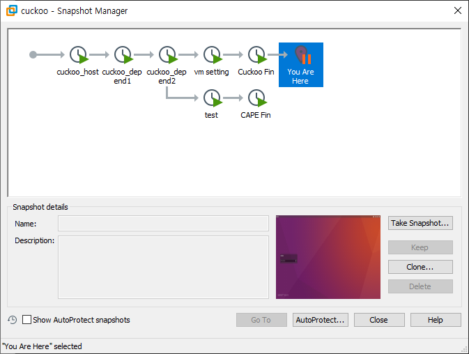
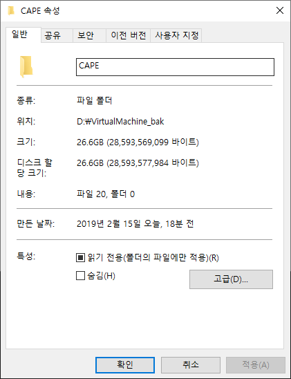
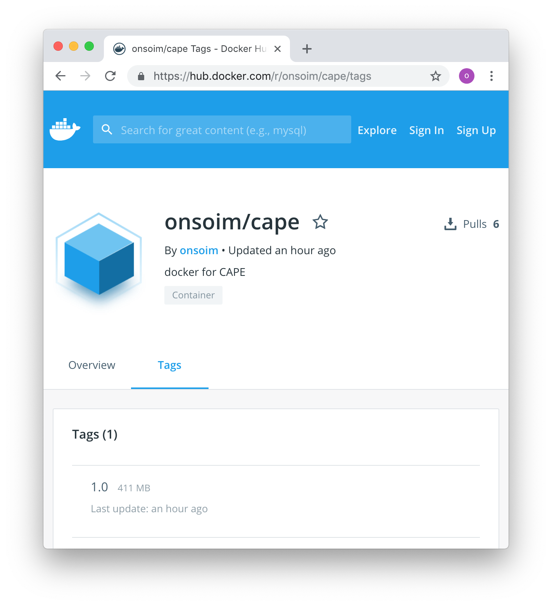
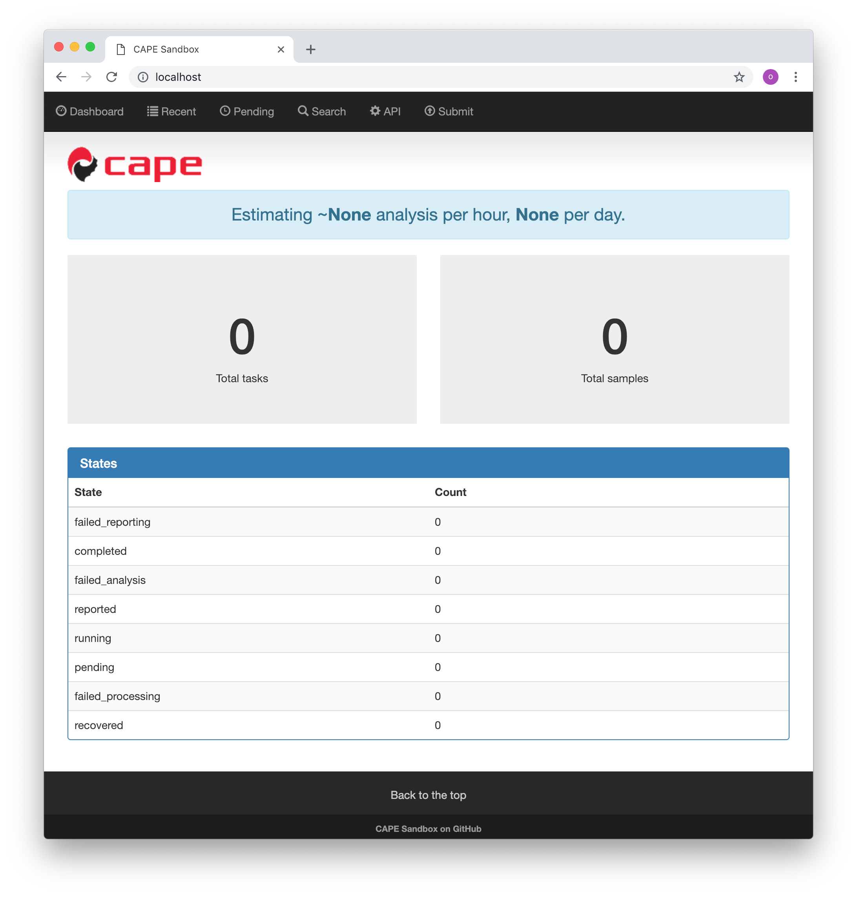

[TOC]

# 1. Description of Project

## 1.1 Purpose of Project

To provide docker image of CAPE.

## 1.2 Reason for selection

I chose the dockerize of cape, and below are why I chose dockerize.

### 1.2.1 Difficulty of installing

In my case, I faced too many barriels. So I need to take lots of snapshots.



I just took snapshots during each step of installing to restore machine easily.

### 1.2.2 Study about Docker

I had vague thoughts of studying Docker from quite long time ago, but I had no chance to study it. And finally I got a chance to study.

## 1.3 Benefit

### 1.3.1 Lightweight



[vmware] - This is picture of VMware without any snapshot.



[docker] - It's just less than 500 MB.

### 1.3.2 Easy to share

Docker provides docker's hub like git which can store docker images for free.

### 1.3.3 Performance


Compare with host and docker, docker showed amlost same performance as the host in all parts. 

### 1.3.4 Control

Docker's container has each seperate environment. So easy to contorl the envorionment and seize the dependency.

---

# 2. Guide how to run

## 2.1 Pull image

```bash
docker pull onsoim/cape:1.0
```

You can download image by using simple docker command.

```bash
onsoim:docker-CAPE $ docker pull onsoim/cape:1.0
1.0: Pulling from onsoim/cape
Digest: sha256:8dda59549fe58981eb0dd779a8e4f72f84bf134d78e00b3edd03335d5a786bca
Status: Downloaded newer image for onsoim/cape:1.0
```

This is the result of above command.

## 2.2 Make container

```bash
docker run -it onsoim/cape:1.0 /bin/bash
```

You can run image using above command.

```bash
onsoim:docker-CAPE $ docker run -it onsoim/cape:1.0 /bin/bash
bash-4.4# ls
bin     cape    cuckoo  dev     etc     home    lib     media   mnt     proc    root    run     sbin    srv     sys     tmp     usr     var
bash-4.4# python /cape/cuckoo.py

   ______   __  __   ______   ___   ___   ______   ______
  /_____/\ /_/\/_/\ /_____/\ /___/\/__/\ /_____/\ /_____/\
  \:::__\/ \:\ \:\ \\:::__\/ \::.\ \\ \ \\:::_ \ \\:::_ \ \
   \:\ \  __\:\ \:\ \\:\ \  __\:: \/_) \ \\:\ \ \ \\:\ \ \ \
    \:\ \/_/\\:\ \:\ \\:\ \/_/\\:. __  ( ( \:\ \ \ \\:\ \ \ \
     \:\_\ \ \\:\_\:\ \\:\_\ \ \\: \ )  \ \ \:\_\ \ \\:\_\ \ \
      \_____\/ \_____\/ \_____\/ \__\/\__\/  \_____\/ \_____\/

 Cuckoo Sandbox 1.3-CAPE
 www.cuckoosandbox.org
 Copyright (c) 2010-2015

 CAPE: Config and Payload Extraction
 github.com/ctxis/CAPE
```

This is the result of run container.

## 2.3 Setting conf

Before using CAPE, you should change conf files.

```bash
bash-4.4# ls /cape/conf/
api.conf           auxiliary.conf     cuckoo.conf        esx.conf           kvm.conf           kvmremote.conf     malheur.conf       memory.conf        physical.conf      processing.conf    reporting.conf     virtualbox.conf    vmware.conf        vmwarerest.conf    vmwareserver.conf  vpn.conf           vsphere.conf       xenserver.conf
```

You can find conf files under /cape/conf in CAPE container.

And you can update conf files manually or using python.

```python
import ConfingParser

path_cuckoo = "/cape/conf/cuckoo.conf"
conf_cuckoo = ConfingParser.ConfingParser()
conf_cuckoo.read(path_cuckoo)
with open(path_cuckoo, 'w') as conf:
	conf_cuckoo.set('resultserver', 'ip', '0.0.0.0')
	conf_cuckoo.set('resultserver', 'port', '2042')
	conf_cuckoo.set('cuckoo', 'machinery', 'virtualbox')

	conf_cuckoo.write(conf)
```

This is the sample code for updating cuckoo conf.

---

# 3. Example of results

When you successfully setting conf, you can use CAPE on host.

## 3.1 Container

```bash
onsoim:docker-CAPE $ docker ps
CONTAINER ID        IMAGE               COMMAND             CREATED             STATUS              PORTS                  NAMES
dc799aae725a        onsoim/cape:1.0     "/bin/bash"         About an hour ago   Up About an hour    0.0.0.0:80->8000/tcp   peaceful_shtern
```

As you can see, the container works well.

[*] tip: run engine and webserver as background process by adding '&' at the end of command. Or just use tmux(It also works in GCP, AWS).

[*] tip: `Ctrl + P` -> `Ctrl + Q` can exit the container without terminate contatiner.

## 3.2 Check on Host



Also web version of CAPE works well in the host.