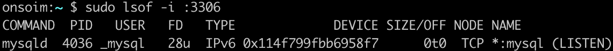
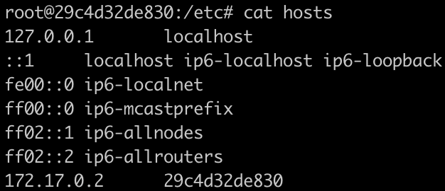

# mysql

```dockerfile
docker run -d -p 13306:3306 -e MYSQL_ALLOW_EMPTY_PASSWORD=true --name mysql mysql:5.7
```

-d 옵션으로 백그라운드에서 컨테이너 실행

-p 옵션으로 포트포워딩, 맥에서는 기본적으로 3306이 사용 중



-e 옵션으로 환경변수를 설정

--name 옵션으로 이름을 지정(mysql)

mysql:5.7은 이미지 이름 및 버전

---

[*] 기본적으로 mysql 서버가 설치되어 있어야 한다.

```dockerfile
mysql --host=127.0.0.1 --port=13306 -uroot
```

# wordpress

워드프레스를 실행하기 위해서는 mysql 세팅을 해 줘야 한다.

```dockerfile
mysql --host=127.0.0.1 --port=13306 -uroot
```

mysql을 실행한다. 13306 포트로 접근했기 때문에, 컨테이너 내의 mysql 서버로 접속된다.

```mysql
create database wp CHARACTER SET utf8;
grant all privileges on wp.* to wp@'%' identified by 'wp';
flush privileges;
quit
```

mysql 에 wp 데이터베이스를 생성하고, 권한을 설정해 준다.

```dockerfile
docker run -d -p 8080:80 --link mysql:mysql -e WORDPRESS_DB_HOST=mysql -e WORDPRESS_DB_NAME=wp -e WORDPRESS_DB_USER=wp -e WORDPRESS_DB_PASSWORD=wp wordpress
```

-d 옵션으로 백그라운드에서 컨테이너 실행

-p 옵션으로 포트포워딩

--link 옵션으로 환경변수와 IP정보를 공유, 링크한 컨테이너의 IP정보를 mysql 컨테이너의 /etc/hosts 에 등록



