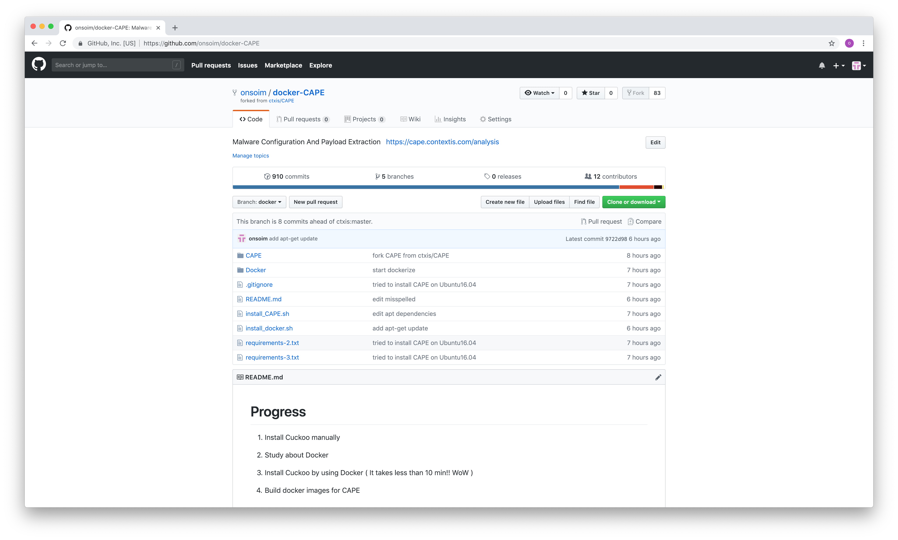

# Progress

## 1. Install Cuckoo manually

[*] Problem: network connection between virtual machine and host machine

## 2. Study about Docker

- I just studied about how to use docker and make docker image.

## 3. Install Cuckoo by using Docker ( It takes less than 5 min!! WoW )

[*] Problem: When I submit a file to Cuckoo, it stucks in pending.

## 4. Build docker images for CAPE

[*] Problem: It's not working properly in my ubuntu.

# Moving Forward

## 4-1. Edit CAPE source code (It's little out of date, so there are some points that I have to edit it.)

First of all, I'm not sure it is for python2 or python3.

In case of django>=1.7, it requires python3.

In python3 `configParser` renamed to `configparser`. In my guess, dJango needs python3 and others need python2.

So they need to evince specific version of python and devide the requirements into python2 and python3.

[*] Working on:

- find apt dependencies
- devide the requirements into python2 and python3.

## 4-2. Make docker Image and Upload to docker hub

## 4-3. Make docker-compose, Dockerfile etc.